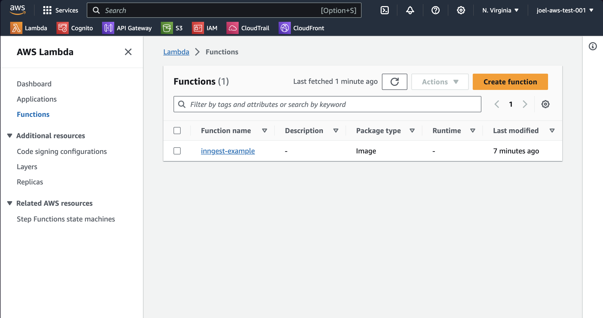
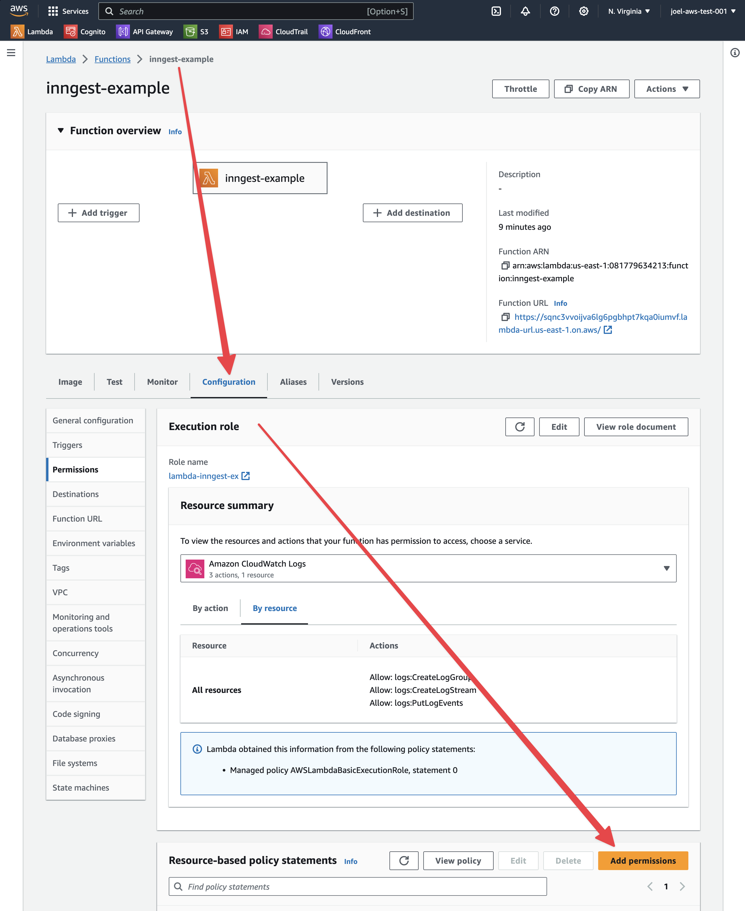
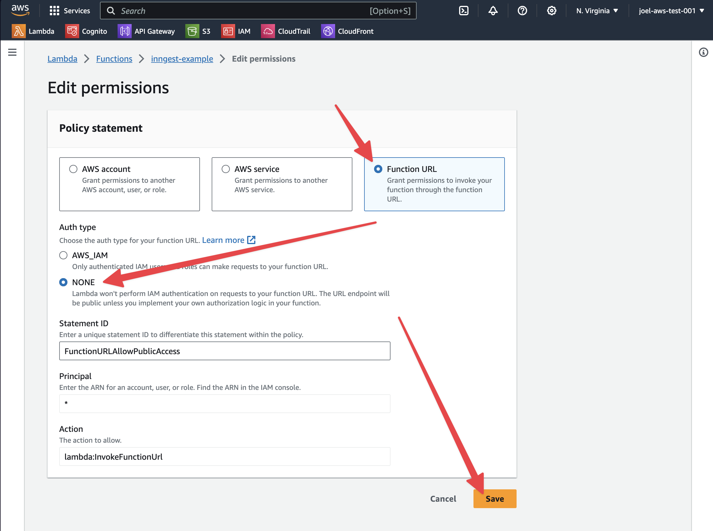
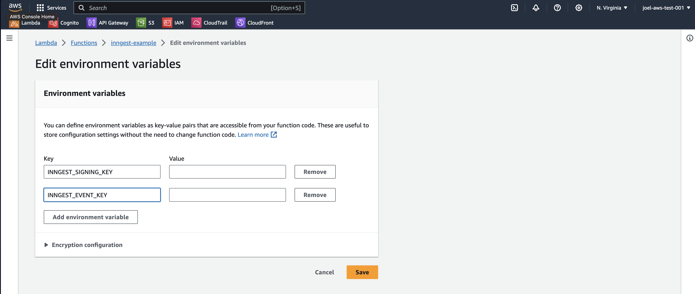
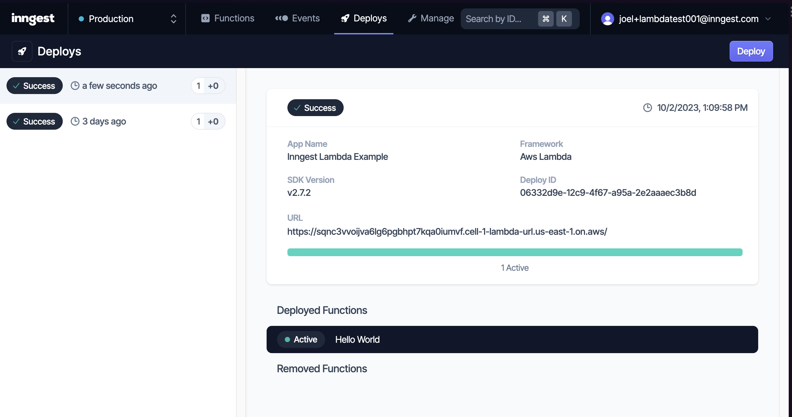

# Inngest AWS Lambda Template

This is an [AWS Lambda container image](https://docs.aws.amazon.com/lambda/latest/dg/gettingstarted-images.html), intended to be deployed as a Lambda using Docker and AWS ECR. Based on the public Node Lambda images, this is a reference on how to react to events using AWS Lambda and Inngest.

## Testing Locally

```shell
# Build and start
npm install
docker build -t example .

# Run your container and set the base URL for the dev server to use the Docker host network
docker run -p 9000:8080 -e INNGEST_BASE_URL=http://host.docker.internal:8288 example

# Run the dev server to test your functions
npx inngest-cli@latest dev -u http://localhost:9000/2015-03-31/functions/function/invocations
```

Then open [http://localhost:8288](http://localhost:8288) to view and test your functions.

## Deploying to AWS Lambda

This template is intended to be deployed to AWS Lambda using Docker and AWS ECR. To do so, you will need to:

1. Create an AWS ECR repository
2. Build and push the image to AWS ECR
3. Create a Lambda function using the image
4. Create a function URL

You'll need to install the [AWS CLI](https://docs.aws.amazon.com/cli/latest/userguide/getting-started-install.html) and [Docker](https://docs.docker.com/engine/install/) to complete these steps.

### Create an AWS ECR repository

You can create an Elastic Container Registry (ECR) repository using the AWS
web console or the AWS CLI. To create a repository using the AWS CLI, run:

```shell
aws ecr create-repository --repository-name inngest-example
```

This will output the following:

```json
{
    "repository": {
        "repositoryArn": "arn:aws:ecr:us-east-1:YOUR_REPOSITORY_ID:repository
      /inngest-example",
        "registryId": "YOUR_REPOSITORY_ID",
        "repositoryName": "inngest-example",
        "repositoryUri": "YOUR_REPOSITORY_ID.dkr.ecr.us-east-1.amazonaws.com/inngest-example",
        "createdAt": "2023-09-29T13:15:57-07:00",
        "imageTagMutability": "MUTABLE",
        "imageScanningConfiguration": {
            "scanOnPush": false
        },
        "encryptionConfiguration": {
            "encryptionType": "AES256"
        }
    }
}
```

The `repositoryUri` is the URI of your repository, which you will need to push images to.

[!note] the `YOUR_REPOSITORY_ID` is the ID of your repository, which you
will need to push images to. It will vary from the example above. You can
set it in your shell with the following command and then access it with `${YOUR_REPOSITORY_ID}`:

```shell
export YOUR_REPOSITORY_ID=YOUR_REPOSITORY_ID_FROM_OUTPUT_ABOVE
```

### Build and push the image to AWS ECR

To build and push the image to AWS ECR, you will need to:

1. Login to public AWS ECR
2. Login to your AWS ECR repository
3. Build the image
4. Tag the image
5. Push the image

Login to public AWS ECR by running:

```shell
aws ecr-public get-login-password --region us-east-1 | docker login --username AWS --password-stdin public.ecr.aws
```

Then you need to login to your new AWS ECR repository. To do so, run:

```shell
aws ecr get-login-password --region us-east-1 | docker login --username AWS --password-stdin ${YOUR_REPOSITORY_ID}.dkr.ecr.us-east-1.amazonaws.com
```

Now you can build the image, run:

```shell
docker build --platform linux/amd64 -t inngest-example .
```

NOTE: If you are on a computer that isn't running `amd64` architecture, you
will need to add `--platform linux/amd64` to the build command for the
Docker image you intend to push.

To tag the image, run:

```shell
docker tag inngest-example:latest ${YOUR_REPOSITORY_ID}.dkr.ecr.us-east-1.amazonaws.com/inngest-example:latest
```

To push the image, run:

```shell
docker push ${YOUR_REPOSITORY_ID}.dkr.ecr.us-east-1.amazonaws.com/inngest-example:latest
```

## Create a Lambda function using the image

To create a Lambda function using the image, you will need to:

1. Create an IAM Lambda role
2. Create a Lambda function
3. Add a function URL

First you'll need to create an IAM Lambda role. To do so, run:

```shell
aws iam create-role --role-name lambda-inngest-ex --assume-role-policy-document '{"Version": "2012-10-17","Statement": [{ "Effect": "Allow", "Principal": {"Service": "lambda.amazonaws.com"}, "Action": "sts:AssumeRole"}]}'
```

grant the role lambda:invokeFunctionUrl to the role. To do so, run:

```shell
aws iam attach-role-policy --role-name lambda-inngest-ex --cli-input-json '{"Version": "2012-10-17","Statement": [{ "Effect": "Allow", "Principal": "*", "Action": "lambda:InvokeFunctionUrl"}]}'
```

This allows the Lambda function to write logs to CloudWatch.

To create a Lambda function, run:

```shell
aws lambda create-function --function-name inngest-example --package-type Image --code ImageUri=${YOUR_REPOSITORY_ID}.dkr.ecr.us-east-1.amazonaws.com/inngest-example:latest --role arn:aws:iam::${YOUR_REPOSITORY_ID}:role/lambda-inngest-ex --timeout 10 --memory-size 128
```

To create a function URL, run:

```shell
aws lambda create-function-url-config --function-name inngest-example --auth-type NONE
```

This will give you output that contains the URL for your new function.
You'll also be able to find the URL in the AWS Console.

This is SO CLOSE, but we need to log in to the AWS Console and perform
`click-ops` to add resource based permissions to the Lambda function.

Log in to the AWS Console and navigate to the Lambda function you just created.



Now open the configuration tab, scroll down to `Resource-based policy
statements` and click `Add Permission`:



Select `Function URL` with Auth type of `None` and click `Save`.



Note that you could do all of the Lambda function configuration outlined
above in the AWS console, but since you are uploading Docker images and
doing the rest in the cli, it's easier to do it all in the cli.

It's also likely possible to do the last step in the cli, but I haven't
figured it out. If you know the command, please submit a PR!

## Testing the Lambda function

Visit the URL for your Lambda function in a browser or with curl.

```json
{
  "message": "Inngest endpoint configured correctly.",
  "hasEventKey": false,
  "hasSigningKey": false,
  "functionsFound": 1
}
```

🎉🎉🎉

We are missing two key pieces here. The Event Key and the Signing Key. Both
of these can be found in your Inngest Cloud dashboard.

Find your Signing key here: https://app.inngest.com/env/production/deploys/

Find your Event key here: https://app.inngest.com/env/production/manage/keys

Within the Lambda configuration tab, scroll down to `Environment variables`
and open that page:



Add your Signing Key and Event Key as environment variables.

You can add your function URL to your deploy in Inngest Cloud. If successful,
you should see something like this:



## Learn More

- [Inngest Documentation](https://www.inngest.com/docs) - learn about the Inngest SDK, functions, and events
- [AWS Lambda container images](https://docs.aws.amazon.com/lambda/latest/dg/images-create.html) - learn about AWS Lambda container images and deployment
